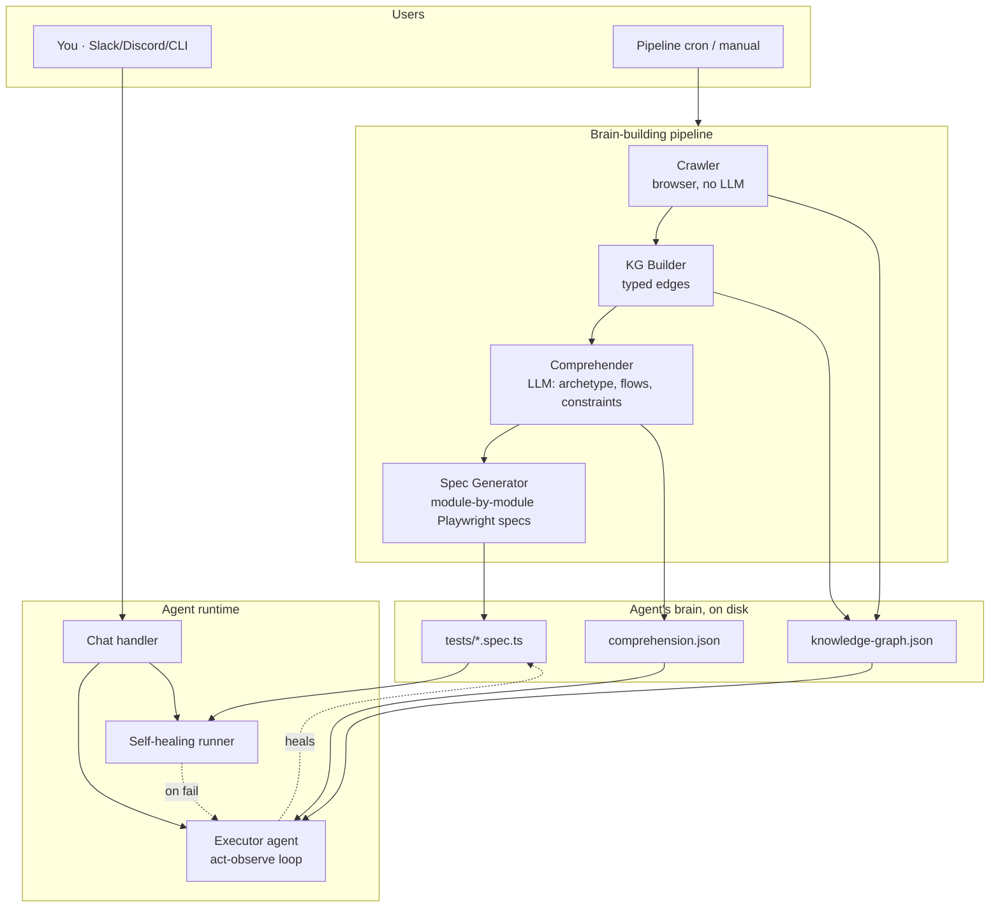
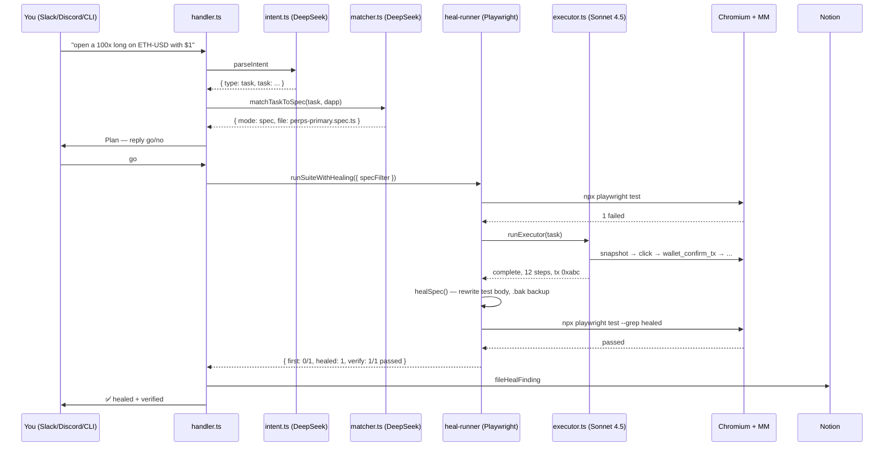
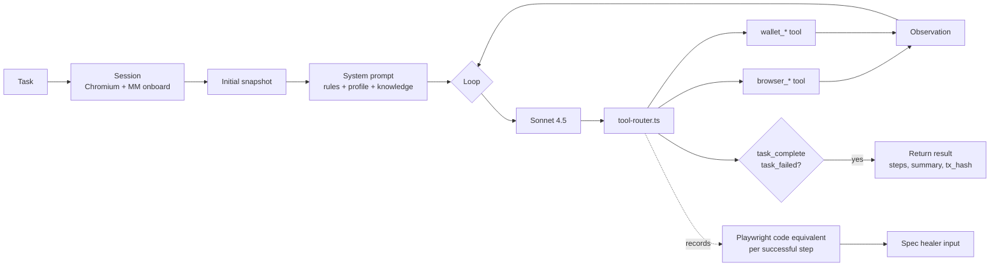
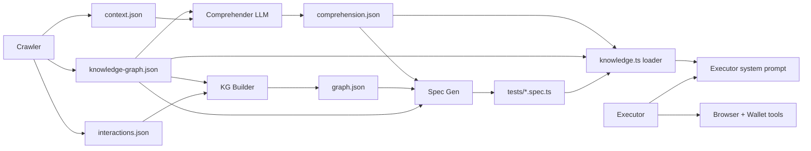

# bugdapp-agent — Architecture

A single-agent Web3 QA system. Crawler, KG builder, comprehender, spec-gen, executor, and self-healer share one runtime — the agent's "brain" is the KG + comprehension artifacts the pipeline writes to disk. The same agent (Claude Sonnet 4.5 via OpenRouter) is used for generating tests, running them, recovering failures, and taking ad-hoc chat tasks.

---

## High-level



---

## Phases

### 1. Crawler — `src/pipeline/crawler.ts`
Browser-driven structural crawl. Visits every reachable page, interacts with every button/form, captures DOM + network + bundle. **No LLM.** Writes:
- `context.json`    metadata
- `scraped-data.json`   per-page elements
- `interactions.json`   what happened when each button was clicked
- `network-raw-apis.json`   intercepted API responses
- `knowledge-graph.json`   initial KG (pages, components, actions)

### 2. KG Builder — `src/pipeline/kg-builder.ts`
Post-processes crawl into typed graph with edges: `CONTAINS`, `REVEALS`, `CONFIGURES`, `SUBMITS`, `CONSTRAINS`, `HAS_OPTION`. Writes `graph.json`. **No LLM.**

### 3. Comprehender — `src/pipeline/comprehender.ts`
Single LLM pass over the KG + docs. Produces structured `comprehension.json`:
- archetype + confidence + evidence
- primary flows with inputs, entities, expected outcomes, risk class
- constraints (min/max amounts, leverage bounds, market hours)
- risks (financial, security)
- adversarial targets (things worth breaking)
- key contracts

### 4. Spec Generator — `src/pipeline/spec-gen.ts`
Deterministic spec emission per primary flow × edge case × asset × order type. **No LLM.** Uses archetype-specific step emitters (`src/agent/archetypes/`) to produce Playwright code that drives the form end-to-end, then classifies terminal state, and on `ready-to-action` submits + verifies.

Output: `output/<host>/tests/*.spec.ts` + `fixtures/wallet.fixture.ts` + `playwright.config.ts`.

### 5. Self-healing runner — `src/pipeline/heal-runner.ts`
Used by `scripts/run.ts` and by the chat handler's spec mode.
1. Runs `npx playwright test` on the specs.
2. For each failed test, spawns the executor agent with the test's intent as a task. Same browser + MM session.
3. On agent success, rewrites the spec's failing `test(...)` body from the agent's recorded Playwright-code-equivalent trace (`src/pipeline/spec-healer.ts`).
4. Re-runs healed specs under pure Playwright to verify. Zero LLM cost from phase 3 onward.

### 6. Executor agent — `src/agent/loop.ts`
Tool-use loop via OpenRouter (Claude Sonnet 4.5 default). Each iteration:
- Takes a fresh `browser_snapshot` (DOM with ref ids)
- Reasons, picks a tool, calls it
- Observes result, loops
- Terminates via `task_complete` or `task_failed`

Budget caps: 20 iterations, 100k tokens, 8 min wall time.

The system prompt is assembled per task:
```
operating rules
+ profile context (URL, chain, archetype playbook)     ← src/agent/prompts.ts
+ knowledge block                                      ← src/agent/knowledge.ts
  ├── dApp summary (comprehension)
  ├── primary flows
  ├── constraints
  ├── rule-like snippets grepped from KG
  ├── risks + adversarial targets
  ├── components per page
  └── existing specs as intent menu
```

Tools:
- `browser_*` (9): navigate, snapshot, click, type, screenshot, evaluate, press_key, scroll, wait
- `wallet_*` (6): approve_connection, sign, confirm_transaction, switch_network, reject, get_address
- `task_complete`, `task_failed` (terminal signals)

### 7. Chat — `src/chat/`
Transports: Discord (`src/chat/discord-bot.ts`), Slack (`src/chat/slack-bot.ts`), local CLI (`scripts/chat.ts`). All call `src/chat/handler.ts`.

Per message:
1. Approval check — if user replies `go`/`no` to a pending plan → run or cancel.
2. Intent parser (`intent.ts`, DeepSeek) → `{task, list, status, help, smalltalk, unknown}`.
3. Spec matcher (`matcher.ts`, DeepSeek) — reads every spec's title + `// Rationale:` + `// Expected:` comments. Picks best spec or returns `act`.
4. Post plan + stage pending approval.
5. On `go`:
   - **Spec mode** → `heal-runner.runSuiteWithHealing({ specFilter })`. Playwright fail → agent cascade → heal → verify.
   - **Act mode** → `runExecutor({ task })` directly.
6. File finding to Notion on failure (`src/chat/notion.ts`).

---

## User flow — you talk to the bot



---

## Agent internals



---

## Folder layout

```
bugdapp-agent/
├── ARCHITECTURE.md         ← this file
├── README.md
├── package.json
├── tsconfig.json
├── .env.example
├── .gitignore
├── data/abis/              on-disk ABI cache
├── templates/              wallet.fixture.ts + playwright.config.ts (copied into output/ at gen)
├── metamask-extension/     bundled MetaMask (gitignored)
├── scripts/
│   ├── pipeline.ts         onboard a dApp: crawl → KG → comprehend → spec-gen
│   ├── run.ts              run specs with self-heal
│   ├── chat.ts             local CLI to talk to the agent
│   └── bot.ts              Discord + Slack bots
├── src/
│   ├── config.ts           ActiveDApp resolved from comprehension.json + viem
│   ├── types.ts            shared types (BrowserCtx, Archetype, TerminalState)
│   ├── core/               infrastructure
│   │   ├── browser-launch.ts      Chromium + MM launcher
│   │   ├── metamask.ts            MM onboarding
│   │   ├── browser-tools.ts       9 browser tool impls
│   │   ├── wallet-tools.ts        6 wallet tool impls
│   │   ├── llm.ts                 OpenRouter client (Anthropic-compatible)
│   │   ├── cost-tracker.ts
│   │   ├── bundle.ts              JS bundle analysis (crawler helper)
│   │   └── network.ts             network capture (crawler helper)
│   ├── chain/              viem clients + receipt decode + ABI registry + anvil
│   ├── agent/
│   │   ├── loop.ts                executor act-observe loop
│   │   ├── session.ts             browser lifecycle (persistent profile)
│   │   ├── knowledge.ts           loads KG + comprehension + rule snippets
│   │   ├── tool-router.ts         dispatches tool calls + records Playwright code
│   │   ├── prompts.ts             system prompt builder
│   │   ├── state.ts               KG types + DAppGraph class
│   │   └── archetypes/            per-archetype spec step emitters (swap/perps/lending/…)
│   ├── pipeline/
│   │   ├── crawler.ts             structural crawl
│   │   ├── crawl-context.ts       browser + docs + network capture
│   │   ├── kg-builder.ts          typed graph
│   │   ├── comprehender.ts        LLM archetype + flows
│   │   ├── spec-gen.ts            module-by-module Playwright emission
│   │   ├── heal-runner.ts         Playwright + self-heal + verify
│   │   └── spec-healer.ts         brace-matched test body rewrite
│   └── chat/
│       ├── intent.ts              NL intent parser (DeepSeek)
│       ├── matcher.ts             spec matcher (DeepSeek, reads rationale/expected)
│       ├── handler.ts             dispatch, plan, approval gate
│       ├── approvals.ts           per-(platform,user,channel) pending store
│       ├── notion.ts              finding filing
│       ├── discord-bot.ts         transport
│       └── slack-bot.ts           transport
├── test/
│   ├── spec-healer.test.ts        4 unit tests (brace matching, backup, edge cases)
│   └── cost-tracker.test.ts       6 unit tests
└── output/
    └── developer-avantisfi-com/   the Avantis brain
        ├── comprehension.json
        ├── knowledge-graph.json
        ├── graph.json
        ├── valid-flows.json
        ├── computed-{all-,edge-,}flows.json
        ├── interactions.json
        ├── tests/                 generated Playwright specs
        ├── fixtures/wallet.fixture.ts
        └── playwright.config.ts
```

---

## Data flow — where knowledge lives



**Key principle:** no per-dApp hand-maintained profile files. Runtime resolves everything from comprehension + chain registry (`src/config.ts`). Fix knowledge by re-running the pipeline, not by editing TS.

---

## Model + cost matrix

| Role | Model | OpenRouter slug | Cost/call |
|---|---|---|---|
| Intent parsing (chat) | DeepSeek | `deepseek/deepseek-chat` | ~$0.001 |
| Spec matching | DeepSeek | `deepseek/deepseek-chat` | ~$0.001 |
| Comprehension (pipeline) | Sonnet 4.5 | `anthropic/claude-sonnet-4.5` | ~$0.02 once per dApp |
| Executor agent (ad-hoc + heal) | Sonnet 4.5 | `anthropic/claude-sonnet-4.5` | ~$0.15–0.40 per task |

Env overrides:
- `EXECUTOR_MODEL` — executor + healer
- `CHAT_MODEL` — intent
- `MATCH_MODEL` — spec matcher
- `DAPP_URL` — active dApp (default Avantis)
- `OPENROUTER_API_KEY`, `SEED_PHRASE`, `METAMASK_PATH` — required

---

## What's wired vs what's not

**Wired (happy path for Avantis):**
- Chat → intent → matcher → plan → approval → spec mode OR act mode
- Executor loop with knowledge from disk (comprehension + KG + docs + rules)
- Self-heal cascade (Playwright fail → executor recover → rewrite spec → verify)
- Notion filing on failure
- 10/10 unit tests passing, typecheck clean

**Built, not live-tested:**
- Full pipeline rebuild from scratch (crawl → spec-gen). Should work but untested end-to-end since the current Avantis brain already exists.
- Transaction signing in act mode (needs wallet with ≥$1 USDC on Base for ZFP 100x min).
- Slack + Discord bots (tokens not set).

**Deferred (noted gaps):**
- Agent-driven explorer phase (crawler enhancement via agent). Comprehension covers this for now.
- On-chain verification post-tx (receipt decode exists, not wired into run loop).
- Multi-dApp support beyond ActiveDApp. Add another via `DAPP_URL` env + re-running pipeline.

---

## Running

```bash
# 1) Onboard a dApp (crawl + comprehend + generate specs)
npm run pipeline -- --url https://developer.avantisfi.com

# 2) Run specs with self-heal
npm run run
npm run run -- --grep perps-primary.spec.ts

# 3) Talk to the agent locally
npm run chat
> open a 100x long on ETH-USD with $1 USDC
> go

# 4) Start Slack + Discord bots (tokens in .env)
npm run bot
```
